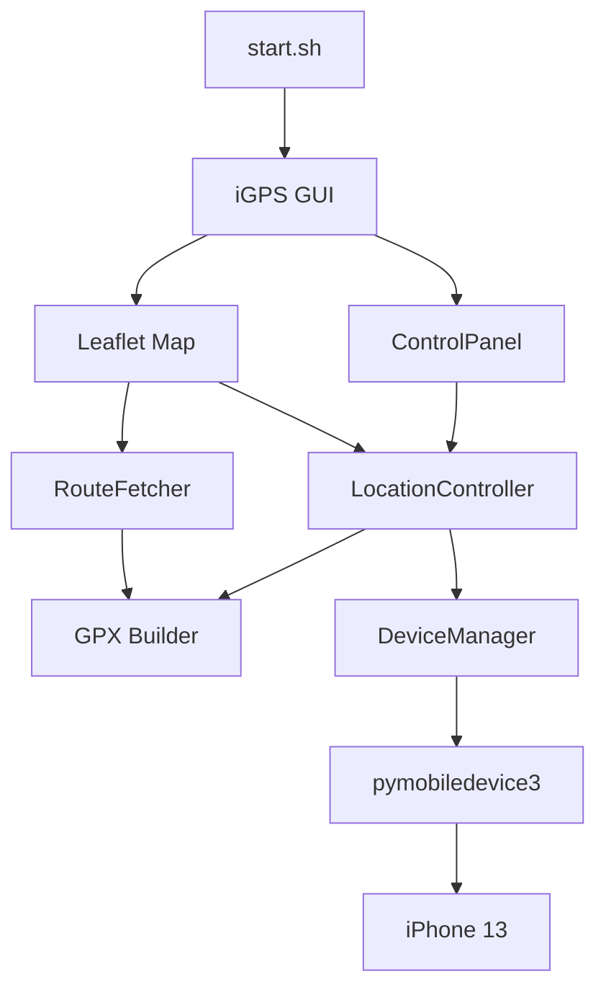

# iGPS — iPhone GPS Location Simulator for Linux

[English](#english) | [中文](README_zh.md)

A powerful desktop tool to control your iPhone's GPS location from Linux. Route simulation, area roaming, joystick control — all from an intuitive map-based UI.

> Based on [marcelafsar/iphone-location-simulator](https://github.com/marcelafsar/iphone-location-simulator) by **Marcel Afsar**, rewritten and enhanced for Linux.

---

## Why iGPS?

| Feature | What it does for you |
|---|---|
| **Map-first design** | Click anywhere on the map to set waypoints — no typing coordinates |
| **Road-snapped routing** | Follows real streets via OSRM, not straight lines. Car, bike, walk, or highway |
| **Area roaming** | Your phone wanders naturally within a radius — walk away and it keeps moving |
| **Joystick micro-control** | Fine-tune position step by step with D-pad or keyboard arrows |
| **Freeze & pin** | Lock your phone at any spot. Stop mid-simulation without reverting to real GPS |
| **One-click start** | `./start.sh` handles everything: tunnel setup, port cleanup, GUI launch |
| **Auto-cleanup** | Close the GUI → all background processes automatically terminated |

## How It Works



> **Note:** If the diagram shows raw code, GitHub's dark-theme Mermaid renderer has a known bug. Switch to [light theme](https://github.com/settings/appearance) or open [diagram.mmd](docs/diagram.mmd).

**Data flow:** Map click → coordinates → GPX waypoints → DVT protocol → iPhone GPS spoofed.

## What Makes It Different

- **Linux native** — fully tested on Ubuntu 24.04. No VM, no Wine, no macOS required
- **iOS 17+ ready** — uses Apple's latest DVT protocol via RSD tunnel (`pymobiledevice3`)
- **Collapsible sidebar** — 4 sub-pages with SVG icons. Collapse to save screen space
- **Right-click context menu** — inspect coordinates, then right-click again to teleport or set route points
- **Dark theme throughout** — every dropdown, menu, and panel stays dark even on Linux GTK
- **Self-diagnosing** — `./start.sh --check` verifies USB, Developer Mode, and tunnel status

## Quick Start

```bash
./start.sh           # One command to launch everything
./start.sh --check   # Diagnostics only
```

Close the GUI → all resources automatically freed.

## Requirements

- Linux (Ubuntu 24.04 tested)
- Python 3.12+
- iPhone with Developer Mode enabled + USB connection
- `sudo` access (tunneld requires root)

## Original Author

**Marcel Afsar** — [marcelafsar/iphone-location-simulator](https://github.com/marcelafsar/iphone-location-simulator)

## License

MIT
