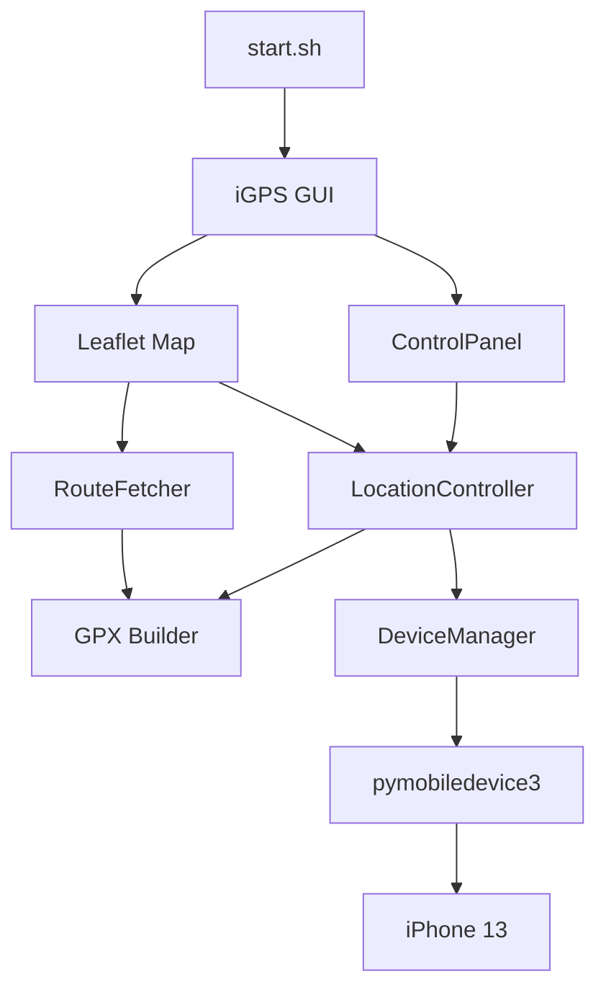

# iGPS — iPhone GPS 定位控制台（Linux 版）

[English](README.md) | [中文](#中文)

從 Linux 桌面控制 iPhone GPS 定位的強大工具。路線模擬、區域漫遊、搖桿控制 — 全部透過直覺的地圖介面操作。

> 基於 [marcelafsar/iphone-location-simulator](https://github.com/marcelafsar/iphone-location-simulator) 由 **Marcel Afsar** 原作，專為 Linux 改寫與增強。

---

## 為什麼選擇 iGPS？

| 特色 | 說明 |
|---|---|
| **地圖直覺操作** | 在地圖上點擊即可設定路線，不需手打座標 |
| **真實道路模擬** | 透過 OSRM 貼合實際道路移動，支援開車 / 騎車 / 步行 / 高速公路 |
| **區域漫遊** | 手機在指定半徑內自然移動，可拔線持續運作 |
| **搖桿微調** | D-pad 或鍵盤方向鍵逐步調整位置 |
| **凍結與固定** | 鎖定手機在任何位置，停止模擬也不會跳回真實 GPS |
| **一鍵啟動** | `./start.sh` 自動處理 tunnel、port、GUI 全部 |
| **關閉即清理** | 關閉 GUI 視窗 → 自動終止所有背景程序 |

## How It Works



> **Note:** If the diagram shows raw code, GitHub's dark-theme Mermaid renderer has a known bug. Switch to [light theme](https://github.com/settings/appearance) or open [diagram.mmd](docs/diagram.mmd).

**Data flow:** Map click → coordinates → GPX waypoints → DVT protocol → iPhone GPS spoofed.

## 與眾不同之處

- **Linux 原生** — Ubuntu 24.04 完整測試，不需 VM、Wine 或 macOS
- **iOS 17+ 支援** — 使用 Apple 最新 DVT 協議，透過 RSD tunnel 通訊
- **折疊側欄** — 4 個子頁面搭配 SVG 圖示，可折疊釋放螢幕空間
- **右鍵選單** — 右鍵查詢座標，再點一次彈出選單：定位 / 設起點 / 設終點
- **全深色主題** — 每個下拉選單、選單、面板在 Linux GTK 下都保持深色
- **自我診斷** — `./start.sh --check` 檢查 USB、開發者模式、tunnel 狀態

## 快速開始

```bash
./start.sh           # 一鍵啟動
./start.sh --check   # 僅診斷，不啟動
```

關閉 GUI 後自動釋放所有資源。

## 需求

- Linux（Ubuntu 24.04 已測試）
- Python 3.12+
- iPhone 已開啟開發者模式 + USB 連線
- `sudo` 權限

## 原作者

**Marcel Afsar** — [marcelafsar/iphone-location-simulator](https://github.com/marcelafsar/iphone-location-simulator)

## 授權

MIT
